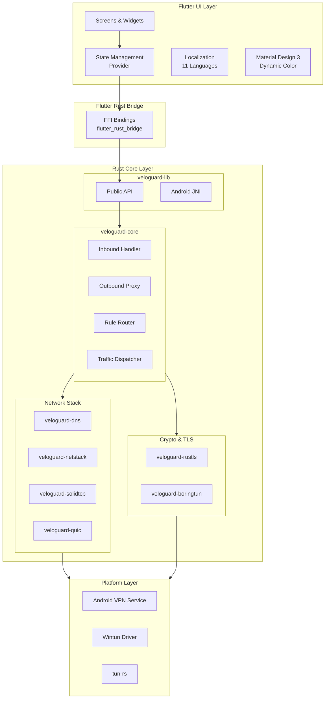
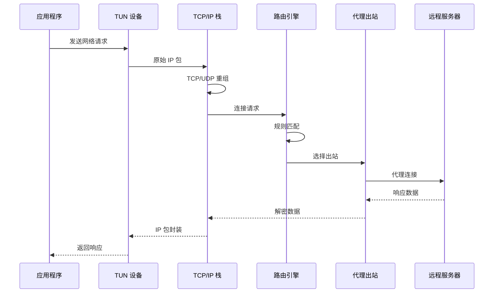
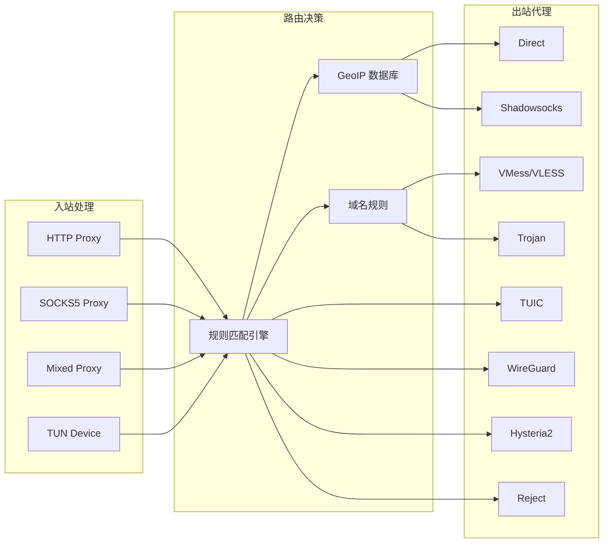

# VeloGuard

<p align="center">
  
</p>

<p align="center">
  <strong>🛡️ 现代化跨平台网络代理客户端</strong>
</p>

<p align="center">
  <em>基于 Flutter + Rust 构建的高性能、安全、易用的网络代理解决方案</em>
</p>

<p align="center">
  <a href="#-项目简介">项目简介</a> •
  <a href="#-核心特性">核心特性</a> •
  <a href="#-支持平台">支持平台</a> •
  <a href="#-系统架构">系统架构</a> •
  <a href="#-快速开始">快速开始</a> •
  <a href="#-开发指南">开发指南</a>
</p>

---

## 📖 项目简介

**VeloGuard** 是一款采用 Flutter + Rust 混合架构开发的跨平台网络代理客户端。项目利用 Rust 的高性能和内存安全特性构建核心代理引擎，通过 Flutter Rust Bridge (FRB) 实现与 Flutter UI 层的高效通信，为用户提供流畅的操作体验和稳定的代理服务。

VeloGuard 支持主流代理协议（Shadowsocks、VMess、VLESS、Trojan、TUIC、Hysteria2、WireGuard 等），提供灵活的路由规则配置，并在 Android 平台通过 VPN Service + TUN 模式实现全局透明代理，在 Windows/macOS/Linux 平台通过 Wintun/tun-rs 实现系统级流量接管。

---

## ✨ 核心特性

### 🚀 高性能 Rust 核心引擎
- **全异步架构**：基于 Tokio 运行时，支持高并发连接处理
- **零拷贝优化**：最小化内存分配，提升数据转发效率
- **智能连接池**：复用连接资源，降低延迟
- **自研 TLS 栈**：基于 rustls 的定制化 TLS 实现

### 🌐 多协议支持

| 协议类型 | 支持协议 |
|---------|---------|
| **代理协议** | HTTP, SOCKS5, Shadowsocks (AEAD-2022), VMess, VLESS, Trojan |
| **隧道协议** | WireGuard, TUIC (QUIC), Hysteria2 |
| **入站协议** | HTTP Proxy, SOCKS5 Proxy, Mixed (HTTP + SOCKS5) |

### 🔧 智能路由系统
- **域名规则**：Domain / DomainSuffix / DomainKeyword / DomainRegex
- **IP 规则**：IP-CIDR / SRC-IP-CIDR / GeoIP
- **端口规则**：SRC-PORT / DST-PORT
- **进程规则**：Process Name 匹配
- **代理组**：Selector / URLTest / Fallback / LoadBalance / Relay

### 🎨 Material Design 3 界面
- Motion-physics 物理动画系统
- 动态颜色主题 (Dynamic Color)
- 响应式布局，适配多种屏幕尺寸
- 支持 11 种语言国际化

### 📊 实时监控与管理
- 流量统计与可视化图表
- 活跃连接管理
- 实时日志查看
- IP 地址检测

---

## 📱 支持平台

| 平台 | 状态 | 最低版本 | 代理模式 |
|------|------|----------|----------|
| Android | ✅ 已支持 | Android 7.0+ | VPN Service + TUN |
| Windows | ✅ 已支持 | Windows 10+ | Wintun TUN / 系统代理 |
| macOS | ✅ 已支持 | macOS 10.15+ | tun-rs TUN / 系统代理 |
| Linux | ✅ 已支持 | Ubuntu 20.04+ | tun-rs TUN / 系统代理 |
| iOS | 🚧 开发中 | iOS 12.0+ | Network Extension |
| HarmonyOS NEXT | 🚧 开发中 | API 12+ | VPN Extension |

---

## 🏗️ 系统架构

VeloGuard 采用分层架构设计，通过 Flutter Rust Bridge 实现 Dart 与 Rust 的高效跨语言通信。

### 整体架构图



### 数据流转流程



### 代理协议处理流程



---

## 📁 项目结构

```
veloguard/
├── lib/                          # Flutter 应用代码
│   └── src/
│       ├── screens/              # 页面组件
│       ├── widgets/              # 可复用组件
│       ├── providers/            # 状态管理
│       ├── services/             # 平台服务
│       ├── l10n/                 # 国际化
│       └── rust/                 # FRB 生成代码
│
├── android/                      # Android 平台代码
│   └── app/src/main/kotlin/
│       └── com/blueokanna/veloguard/
│           ├── MainActivity.kt
│           ├── VeloGuardVpnService.kt
│           └── ...
│
├── rust/                         # Rust 工作空间
│   ├── veloguard-lib/            # Flutter FFI 绑定层
│   ├── veloguard-core/           # 核心代理逻辑
│   ├── veloguard-dns/            # DNS 解析器
│   ├── veloguard-netstack/       # 网络栈 (smoltcp)
│   ├── veloguard-solidtcp/       # TCP/IP 栈
│   ├── veloguard-quic/           # QUIC 协议实现
│   ├── veloguard-rustls/         # 自定义 TLS 实现
│   ├── veloguard-boringtun/      # WireGuard 实现
│   ├── tokio-veloguard-tls/      # Tokio TLS 适配器
│   ├── tuic/                     # TUIC 协议
│   ├── tuic-quinn/               # TUIC QUIC 实现
│   ├── veloguard-sock2proc/      # 进程名查询
│   ├── unix-udp-sock/            # Unix UDP Socket
│   ├── console-subscriber/       # 调试订阅器
│   └── veloguard-bin/            # CLI 程序
│
├── ios/                          # iOS 平台代码
├── macos/                        # macOS 平台代码
├── windows/                      # Windows 平台代码
├── linux/                        # Linux 平台代码
└── ohos/                         # HarmonyOS 平台代码
```

---

## 🚀 快速开始

### 环境要求

#### Flutter 开发环境
- Flutter SDK 3.24+
- Dart SDK 3.5+
- Android Studio / VS Code
- Xcode 15+ (macOS/iOS 开发)

#### Rust 开发环境
- Rust 1.75+ (推荐使用 rustup)
- Cargo
- Android NDK r25+ (Android 开发)
- LLVM/Clang (Windows 开发)

### 构建步骤

```bash
# 1. 克隆项目
git clone https://github.com/aspect-build/veloguard.git
cd veloguard

# 2. 安装 Flutter 依赖
flutter pub get

# 3. 安装 Rust 依赖
cd rust && cargo fetch && cd ..

# 4. 生成 FFI 绑定代码
flutter_rust_bridge_codegen generate

# 5. 构建 Android (需要 Android NDK)
cd rust
cargo ndk -t arm64-v8a -t armeabi-v7a -o ../android/app/src/main/jniLibs build --release
cd ..

# 6. 运行应用
flutter run
```

### 构建发布版本

```bash
# Android APK
flutter build apk --release

# Android App Bundle
flutter build appbundle --release

# Windows
flutter build windows --release

# macOS
flutter build macos --release

# Linux
flutter build linux --release
```

---

## 🔧 开发指南

### Rust 核心开发

```bash
# 进入 Rust 工作空间
cd rust

# 运行测试
cargo test --workspace

# 代码检查
cargo clippy --workspace

# 格式化代码
cargo fmt --all

# 构建 CLI 工具
cargo build -p veloguard-bin --release
```

### Flutter UI 开发

```bash
# 代码分析
flutter analyze

# 运行测试
flutter test

# 生成国际化文件
flutter gen-l10n
```

### 调试技巧

```bash
# 启用 Rust 日志
RUST_LOG=debug flutter run

# Android 日志查看
adb logcat | grep -E "(VeloGuard|rust)"

# 性能分析
flutter run --profile
```

---

## 📄 配置文件格式

VeloGuard 兼容 Clash 配置格式，支持以下配置项：

```yaml
# 基础配置
mixed-port: 7890
socks-port: 7891
allow-lan: false
mode: rule
log-level: info

# DNS 配置
dns:
  enable: true
  listen: 0.0.0.0:53
  enhanced-mode: fake-ip
  nameserver:
    - 223.5.5.5
    - 119.29.29.29

# 代理节点
proxies:
  - name: "proxy-1"
    type: ss
    server: server.example.com
    port: 443
    cipher: aes-256-gcm
    password: "password"

# 代理组
proxy-groups:
  - name: "Proxy"
    type: select
    proxies:
      - proxy-1
      - DIRECT

# 路由规则
rules:
  - DOMAIN-SUFFIX,google.com,Proxy
  - GEOIP,CN,DIRECT
  - MATCH,Proxy
```

---

## 🤝 贡献指南

欢迎提交 Issue 和 Pull Request！

1. Fork 本仓库
2. 创建特性分支 (`git checkout -b feature/amazing-feature`)
3. 提交更改 (`git commit -m 'Add amazing feature'`)
4. 推送到分支 (`git push origin feature/amazing-feature`)
5. 创建 Pull Request

---

## 📜 许可证

本项目采用 [AGPL-3.0](LICENSE) 许可证开源。

---

## 💖 致谢与捐赠

如果 VeloGuard 对你有帮助，欢迎通过以下方式支持项目发展：

|  **USDT** |  **USDC** |  **Dash** |
|:---:|:---:|:---:|
| Arbitrum One | Arbitrum One | Dash Network |
| `0x4051d34Af2025A33aFD5EacCA7A90046f7a64Bed` | `0x4051d34Af2025A33aFD5EacCA7A90046f7a64Bed` | `XuJwtHWdsYzfLawymR3B3nDdS2W8dHnxyR` |

---

<p align="center">
  Made with ❤️ by <a href="https://github.com/aspect-build">Blueokanna</a>
</p>

<p align="center">
  <sub>🛡️ Secure • 🚀 Fast • 🎨 Beautiful</sub>
</p>
